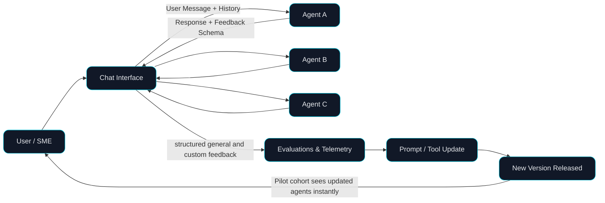

# If You Need a New UI for Every AI Use Case, You're Doing It Wrong 

* LLMs removed the label bottleneck but not the knowledge bottleneck for industry application
* Annotation moved from “pre-model” (labels) to “post-model” (prompts, tools, guardrails, evals), but our tooling didn’t.
* Hypothesis: If teams collect feedback for all agents in one place, they’ll improve them faster and scale to 10+ use-cases with the same resources.

## Why Now

LLMs shorten build cycles from months to days and relaxed our dependence on labeled data, but they didn’t eliminate domain knowledge. That expertise still lives in people’s heads and scattered systems. To bridge the gap, developers often spin up one-off pilots (Streamlit, Gradio) to collect feedback. It’s tend to work fine for one use-case, but it falls apart at ten.

* **New bottleneck**: With models easy to prototype, the constraint is knowledge capture and iteration speed, not training.
* **Shifted annotation**: What used to happen pre-model (labels) now happens post-model (in prompts, tools, guardrails, and evals), but the tooling hasn’t caught up.
* **Feedback chaos**: Input often comes from email/Zoom/DMs or bespoke UIs. There’s no standard path from feedback to prompt/tool change, to measurable lift.

## Bottleneck

- Knowledge is trapped in SMEs and pilot chats.
- Feedback is fragmented across bespoke UIs and channels.
- Nothing scales past a handful of use-cases: duplicated components, inconsistent telemetry, hard-to-compare experiments.
- No closed loop: it’s unclear which prompt/tool change improved what metric for which cohort.

## [What good looks like?](https://syngularai.com/)

- Single conversation surface where users/SMEs can try any agent.
- Structured feedback primitives (thumbs + reason, rubric scores, error tags, suggested responses, tool/run traces).
- Assignment & cohorts (pilot groups, roles, data slices).
- Experiment tracking (prompt/tool versioning tied to offline/online metrics).
- Portable across use-cases (no per-app UI rebuild).
